# 🍬 Sweet Shop Management System – Frontend

<div align="center">

**A modern React-based e-commerce platform for managing and browsing premium sweets**

[](https://react.dev)
[](https://vitejs.dev)
[](https://tailwindcss.com)
[](#license)

[Features](#-features) • [Tech Stack](#-tech-stack) • [Quick Start](#-quick-start) • [Documentation](#-documentation)

</div>

---

## 📸 Screenshots & Demo

<div align="center">
  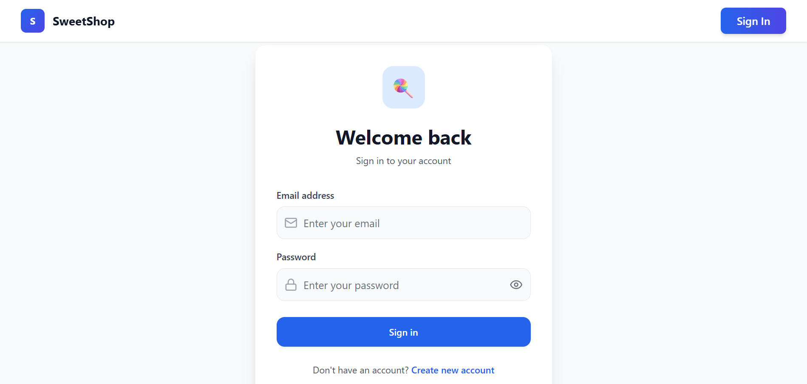
  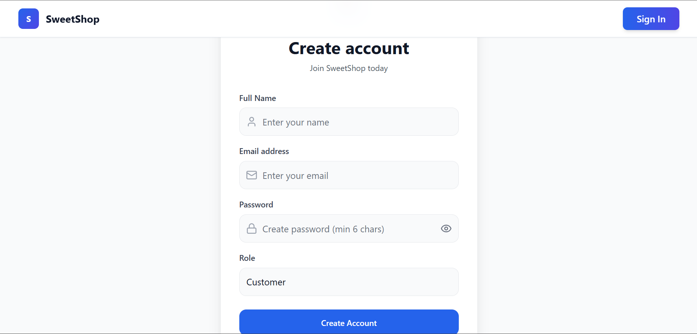
  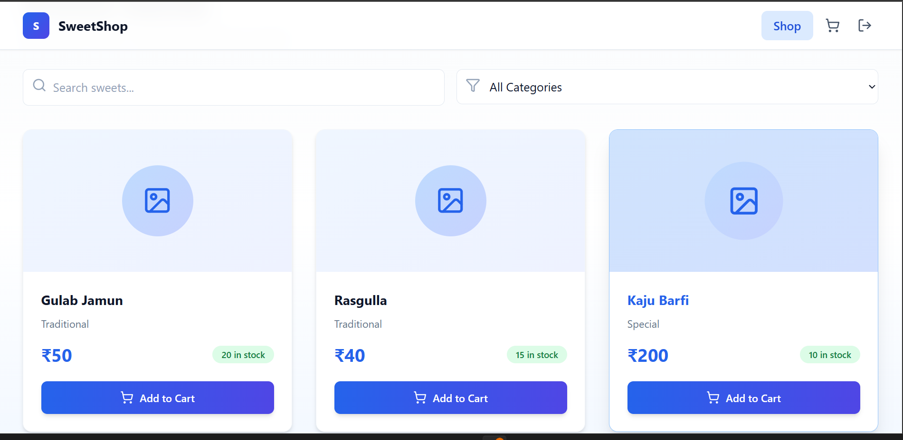
  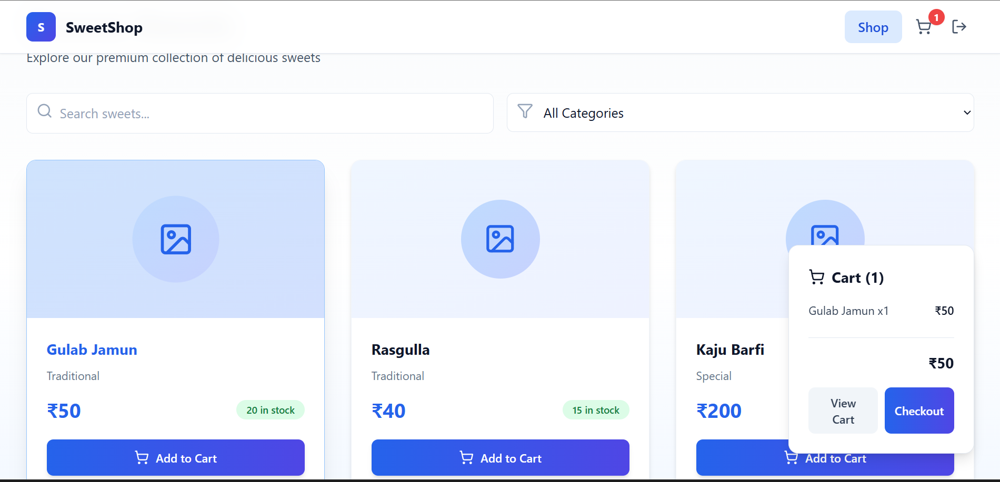
</div>

<div align="center">
  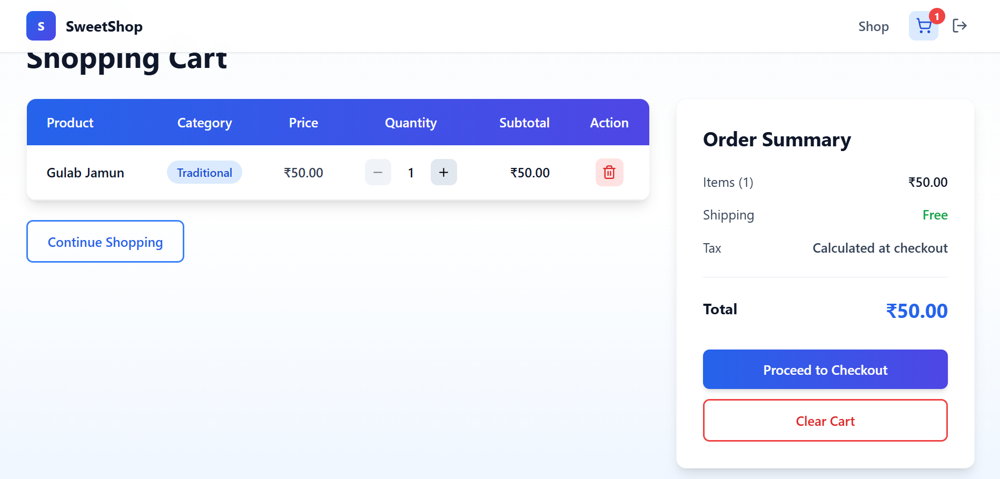
  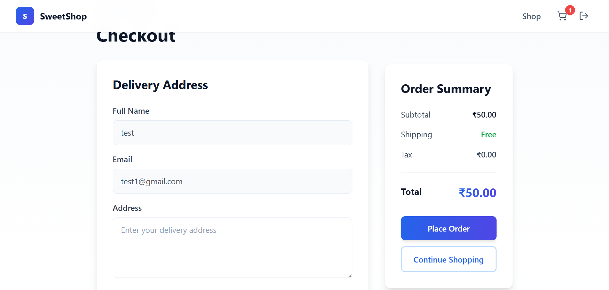
  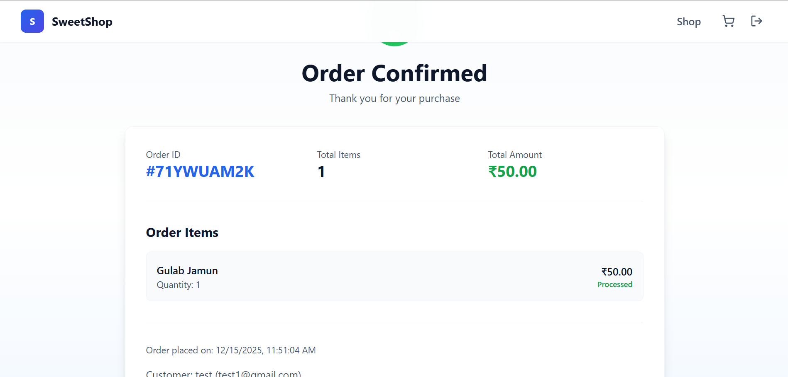
  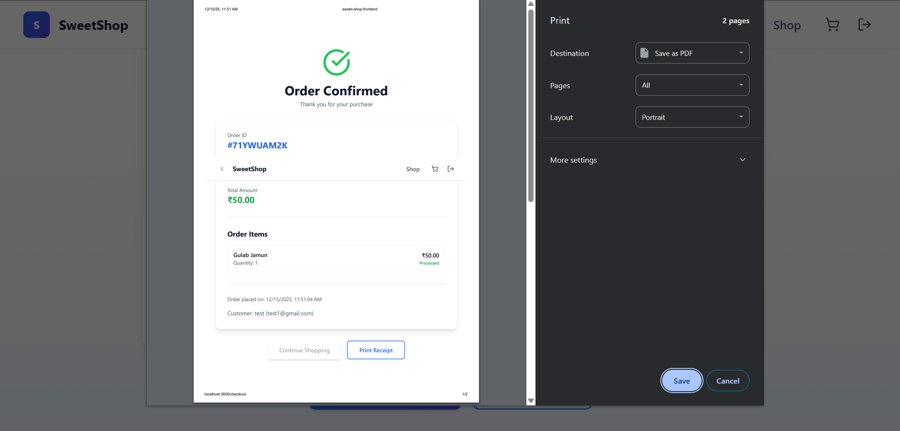
</div>

<div align="center">
  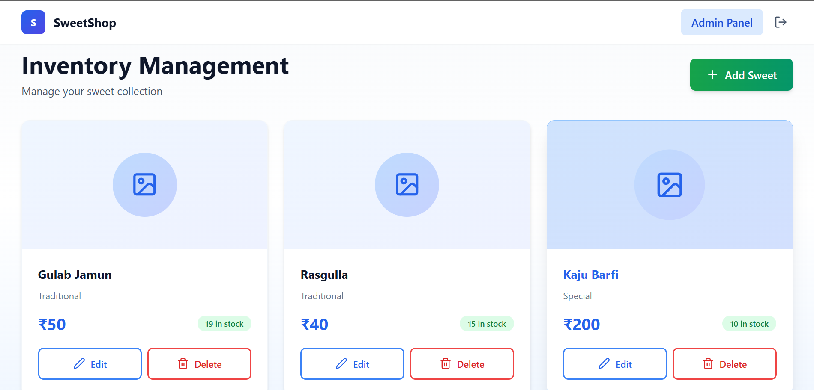
  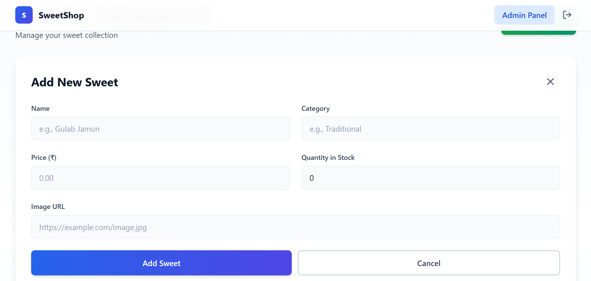
  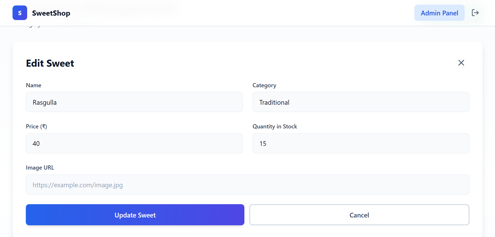
</div>

---

## ✨ Features

### 👥 **Customer Features**
- ✅ Register and login with email/password
- ✅ Browse sweets in responsive grid layout
- ✅ **Search** by name and description
- ✅ **Filter** by category
- ✅ View price & stock availability
- ✅ Smart cart system:
  - Add items to cart
  - Update quantities
  - Remove items
  - Real-time total price calculation
- ✅ Checkout with order confirmation
- ✅ Print order receipts

### 🛠️ **Admin Features**
- ✅ Protected admin dashboard
- ✅ **Create** new sweets with images
- ✅ **Edit** existing sweet details
- ✅ **Delete** sweets with confirmation
- ✅ Inventory management (track quantities)
- ✅ Form validation with error messages
- ✅ Image URL support with live preview

---

## 🏗️ Tech Stack

| Category | Technology |
|----------|------------|
| **Framework** | React 18+ with Vite |
| **Styling** | Tailwind CSS v3 |
| **Routing** | React Router DOM v6 |
| **HTTP Client** | Axios |
| **Icons** | Lucide React |
| **State Management** | React Context API |
| **Testing** | Vitest + React Testing Library |
| **Design** | Modern Blue/Indigo/Slate Color System |

---

## 📁 Project Structure

```
src/
├── components/
│   ├── Navbar.jsx          # Navigation bar with cart badge
│   ├── ProtectedRoute.jsx  # Route guard for auth & admin
│   └── SweetCard.jsx       # Reusable sweet card component
├── context/
│   ├── AuthContext.jsx     # Authentication state management
│   └── CartContext.jsx     # Shopping cart state management
├── pages/
│   ├── Login.jsx           # User login page
│   ├── Register.jsx        # User registration page
│   ├── Dashboard.jsx       # Customer sweet browsing
│   ├── Admin.jsx           # Admin inventory management
│   ├── Cart.jsx            # Shopping cart view
│   └── Checkout.jsx        # Order confirmation
├── services/
│   └── api.js              # Axios instance & API endpoints
├── App.jsx                 # Main router configuration
└── main.jsx                # React entry point
```

---

## 🚀 Quick Start

### Prerequisites
- Node.js 16+
- Backend server running on `http://localhost:4000`
- MongoDB connected to backend

### Installation

```bash
# Navigate to frontend folder
cd sweet-shop-frontend

# Install dependencies
npm install

# Start development server
npm run dev
```

The app will run at: **http://localhost:3000**

### Backend Setup

Ensure your backend is running on port 4000 with:
- `POST /api/auth/login`
- `POST /api/auth/register`
- `GET /api/sweets`
- `POST /api/sweets`
- `PUT /api/sweets/:id`
- `DELETE /api/sweets/:id`

---

## 📚 Documentation

### Authentication Flow

#### Admin Login
```
1. Run backend seed script: node seed/seed.js
2. Visit http://localhost:3000/login
3. Login with:
   - Email: admin@sweets.com
   - Password: AdminPass123!
4. Redirected to Dashboard
5. Admin Panel link appears in navbar
```

#### Customer Registration
```
1. Visit http://localhost:3000/register
2. Fill in: Name, Email, Password
3. Select "Customer" as role
4. After registration, automatically logged in
5. Redirected to Dashboard
```

### Environment Configuration

Update API base URL in `src/services/api.js`:

```javascript
// src/services/api.js
const API_BASE_URL = 'http://localhost:4000/api';
```

If your backend runs on a different port, update this value.

---

## 🎨 Color System

The application uses a modern professional design:

| Element | Color |
|---------|-------|
| Primary | Blue-600 / Indigo-600 |
| Secondary | Blue-700 / Indigo-700 |
| Neutral | Slate-50 to Slate-900 |
| Success | Green-600 |
| Error | Red-500 / Red-700 |
| Background | Gradient: Slate-50 → White → Blue-50 |

---

## 📖 Usage Guide

### Customer Dashboard
- **View Sweets**: Grid of all available items with images
- **Search**: Filter by sweet name
- **Category Filter**: Dropdown to filter by type
- **Add to Cart**: Purchase sweets (enabled when stock > 0)
- **View Cart**: Click cart icon in navbar
- **Checkout**: Complete purchase and view confirmation

### Admin Panel
- **Access**: Click "Admin Panel" link in navbar (admin only)
- **Add Sweet**: 
  - Click "Add Sweet" button
  - Fill: Name, Category, Price, Quantity, Image URL
  - Submit to create
- **Edit Sweet**: Click "Edit" on any card, modify, submit
- **Delete Sweet**: Click "Delete", confirm in dialog
- **View Preview**: Image preview shows when entering URL

### Cart & Checkout
- **View Items**: Click cart icon (shows badge with count)
- **Update Quantity**: Increase/decrease per item
- **Remove Item**: Delete button removes from cart
- **Checkout**: Enter delivery address, select payment method
- **Confirm Order**: Review order summary and place order
- **Print Receipt**: Print order confirmation

---

## 🧪 Testing

Run tests with:
```bash
npm test
```

Configuration files:
- `vite.config.js` - Test setup
- `src/test/setup.js` - Test environment

Add tests in `src/**/*.test.jsx` format.

---

## 🔮 Future Improvements

- [ ] Add full test coverage (Auth, Dashboard, Admin CRUD)
- [ ] Implement backend order persistence
- [ ] Add pagination/infinite scroll for large catalogs
- [ ] Enhance error boundaries for network failures
- [ ] Add user profile and order history pages
- [ ] Implement payment gateway integration
- [ ] Add product reviews and ratings
- [ ] Mobile app version with React Native
- [ ] Multi-language support (i18n)
- [ ] Dark mode theme

---

## 📝 AI Usage & Attribution

This project uses AI tools for development. When committing with AI assistance, use:

```bash
git commit -m "feat: add dashboard search and filter

Implemented customer sweet browsing with search and category filtering.

Co-authored-by: GitHub Copilot <noreply@github.com>"
```

This maintains transparency and proper attribution.

---

## 📄 License

This project respects all relevant copyrights and intellectual property.

Adapt or extend the license section to match your backend repository's license.

---

<div align="center">

**Made with ❤️ for sweet lovers**

[⬆ Back to top](#-sweet-shop-management-system--frontend)

</div>
